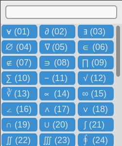
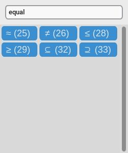

# emathji
[](https://www.python.org/)
[](https://unlicense.org/)

**emathji** (*emoji + math*) is a Python-based GUI application designed for quickly searching and copying commonly used mathematical symbols to the clipboard, just like an emoji picker. The application uses the `customtkinter` library for the graphical interface and `pyperclip` for clipboard operations.

## Installation

Just download the `emathji.py` script from this repository.

## Dependencies
```
pip install pyperclip customtkinter
```

## Usage and options
Ideally, you would bind this script to a specific key combination for quick access anywhere.

When the script runs, a 250x300 window appears, as shown here:



In the window, you can either click a button to copy a symbol to your clipboard or type the two-character key combination displayed in parentheses next to each symbol. The search bar at the top can be clicked to enter a search term, filtering the symbols in real-time, as illustrated below.



Pressing the Escape key will close the window. Alternatively, the window will close automatically after you select a symbol using one of the methods described above.

New symbols or different two-character key combinations can be added by editing the python script itself. 
## Contributing

Pull requests are welcome. For major changes, please open an issue first
to discuss what you would like to change.

## License

[Unlicense](UNLICENSE)
